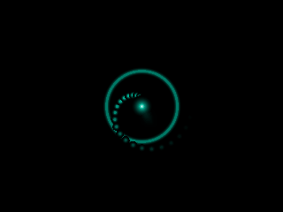

# assist-avatar

An animated avatar for the **ESP32-S3-Box-3** voice assistant (ESPHome + Home
Assistant). A calm, faceless cyan "synthetic mind" in the spirit of the
*Cyberpunk 2077* AIs — neon glow, sub-pixel-smooth motion — that reacts to every
assistant state. Designed to be **child-safe** (no face, no harsh red, slow
organic motion) and to look good at night.

<p align="center">
  
</p>

It ships as an **ESPHome `external_components` overlay**: you keep the official
Nabu Casa voice-assistant firmware exactly as-is (still upgradable) and this
package overrides *only* the display rendering. Wake word, voice pipeline, timers
and the built-in connection screens all keep working — the avatar simply replaces
what is drawn on each screen.

> **v0.4.0 is a breaking change** from v0.3.x. The avatar is now a proper ESPHome
> component with **per-state, per-animation** controls that you pick (and persist)
> from Home Assistant — no reflash. See [docs/MIGRATION-v0.4.0.md](docs/MIGRATION-v0.4.0.md).

## What you get

Ten animations in the catalogue — **amber_pulse, breathing_ring, converging,
dim_ring, loading_arc, orb, orbits, scan_arc, sonar, waveform** — and you choose
which one plays for each assistant state. Defaults:

| State | Default animation | What it means | |
|---|---|---|---|
| **Idle** | `breathing_ring` | connected and ready, slow "breathing" |  |
| **Listening** | `converging` | particles stream into a hot core |  |
| **Thinking** | `orb` | a Siri-style luminous orb (6 variations) |  |
| **Replying** | `waveform` | a horizontal energy waveform |  |
| **Booting** | `loading_arc` | a loading arc filling up |  |
| **No Wi-Fi** | `sonar` | searching the network (sonar waves) |  |
| **Connecting to HA** | `scan_arc` | linking to Home Assistant (scanning arc) |  |
| **Error** | `amber_pulse` | soft amber pulse (stays amber, calm alert) |  |
| **Muted** | `dim_ring` | a dim ring with a slash |  |

For **every** state, the component auto-creates Home-Assistant controls and your
choices **survive a reboot** (the YAML values are only first-boot defaults):

- **`<State> animation`** (select) — swap in any animation from the catalogue.
- **`<State> animation speed`** (number) — speed it up or slow it down.
- **`<State> animation variation`** (select) — where the animation has variations
  (the orb: `siri / calm / sleeping / agitated / spike / happy`).
- **`<State> accent`** (RGB light) — recolour that state's animation in real time.

While **thinking** and **replying**, your request and the assistant's answer are
also **typed out** over the avatar in a phosphor-CRT style (VT323 font), from the
upstream STT/TTS text sensors — a blinking block cursor reveals the text one
character at a time.

## How it works

The official S3-Box-3 firmware renders its UI with a `display:` that has one
**page per state** (`idle_page`, `listening_page`, … plus `no_wifi_page`,
`no_ha_page`, `initializing_page`) and switches between them. This package uses
ESPHome's `!extend` to replace each page's draw lambda with a call into the
avatar's runtime state table, and bumps the refresh rate so the avatar animates:

```yaml
display:
  - id: !extend s3_box_lcd
    update_interval: 66ms
    pages:
      - id: !extend idle_page
        lambda: 'avatar::render_state(it, avatar::IDLE, millis());'
      # … one per page (shipped in avatar-pages.yaml)
```

`render_state` reads the minted anim-select / speed / variation / accent for that
phase and dispatches to the configured animation module. Because upstream already
decides *which* page to show (Wi-Fi / HA / voice state), the avatar gets every
state — including the connection states — for free.

Each animation is a drop-in module under `components/avatar/animations/<id>/`
(`<id>.h` + a `manifest.yaml` declaring its name, default-per-phase, speed range
and colour roles). The component discovers them at build time and generates the
dispatch + the HA controls. Animation is driven by **wall-clock time**
(`millis()`), not a frame counter, so motion looks the same on the desktop
emulator and the device.

## Install

### Option A — remote, one line (recommended; works from the HA ESPHome dashboard)

Add the avatar overlay package **after** the voice-assistant one, then declare a
minimal `avatar:` block. Nothing to copy:

```yaml
packages:
  # the line your device already has (keep it):
  esphome.voice-assistant: github://esphome/wake-word-voice-assistants/esp32-s3-box-3/esp32-s3-box-3.factory.yaml@main
  # add the avatar overlay (must come AFTER the line above):
  assist-avatar: github://thekoma/assist-avatar/avatar-remote.yaml@v0.4.0

avatar:
  idle:      { animation: breathing_ring }
  listening: { animation: converging }
  thinking:  { animation: orb, variation: {} }
  replying:  { animation: waveform }
  error:     { animation: amber_pulse }
  muted:     { animation: dim_ring }
  booting:   { animation: loading_arc }
  no_wifi:   { animation: sonar }
  no_ha:     { animation: scan_arc }
```

Keep your existing `name` / `api:` / `wifi:` as they are, then **Install →
Wirelessly**. Pin a release tag (e.g. `@v0.4.0`); the engine `ref:` inside
`avatar-remote.yaml` is pinned to the same tag, so the YAML, the page overlay and
the C++ are fetched from one commit. A full example is in
[`esp32-s3-box-3.example.yaml`](esp32-s3-box-3.example.yaml).

### Option B — local files

Prerequisites: ESPHome (e.g. `uv venv && uv pip install esphome`).

1. Clone this repo (or copy `components/` and `avatar-pages.yaml` next to your
   device YAML — e.g. into HA's `/config/esphome/`).
2. `cp secrets.yaml.example secrets.yaml` and fill it in (2.4 GHz Wi-Fi; generate
   an API key with `openssl rand -base64 32`).
3. `cp esp32-s3-box-3.example.yaml my-box.yaml`, set `name` / `friendly_name`, and
   switch the avatar package to the local source (commented in the example):
   ```yaml
   external_components:
     - source: { type: local, path: components }
       components: [avatar]
   packages:
     avatar_pages: !include avatar-pages.yaml
   ```
4. First flash over USB, then over the air: `esphome run my-box.yaml`.

Then in Home Assistant: add the auto-discovered **ESPHome** device, assign it a
**Voice assistant pipeline**, keep **Wake word engine location = On device**, and
say **"Okay Nabu"** — the screen switches to the listening animation. The per-state
`<State> animation` / `speed` / `variation` / `accent` entities appear under the
device; change them live and they persist.

## Develop (desktop emulator — no flashing)

ESPHome's SDL backend runs the display on your computer, so you can iterate on the
graphics in seconds. Requires `brew install sdl2 libsodium` (macOS) and ESPHome.

```bash
./dev.sh          # = esphome clean + run dev-host.yaml  (a window opens)
```

Click the window to cycle through the whole animation catalogue. Edit any module
header under `components/avatar/animations/` and re-run `./dev.sh`.

> **Why `./dev.sh` and not a bare `esphome run`?** ESPHome only re-runs code
> generation (and re-copies headers) when the YAML changes. Editing only the `.h`
> files leaves the config hash unchanged, so a plain run launches the *old* binary.
> `dev.sh` does a `clean` first to avoid that.

## Tests

The pure math and the render bounds are tested on the host (no hardware). The
engine source lives under the component, so add both include roots:

```bash
c++ -std=c++17 -Icomponents/avatar/base -Icomponents/avatar test/test_avatar_math.cpp -o /tmp/t && /tmp/t
c++ -std=c++17 -Itest/shim -Icomponents/avatar/base -Icomponents/avatar test/test_render.cpp -o /tmp/t && /tmp/t
```

`test_render.cpp` runs every state across a time sweep with a mock display that
fails on any out-of-bounds draw — it catches the kind of off-screen write that can
crash the device, on the host, before flashing.

## Regenerate the GIFs

```bash
./tools/make_gifs.sh    # renders the catalogue to assets/*.gif (needs ffmpeg)
```

## Credits

Built on the official [ESPHome wake-word voice assistants](https://github.com/esphome/wake-word-voice-assistants).
Avatar engine and packaging by [@thekoma](https://github.com/thekoma). MIT licensed.
