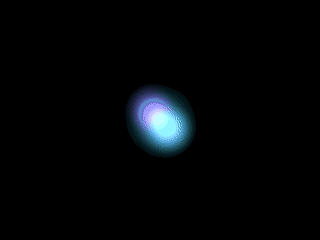
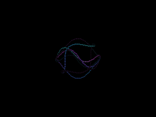
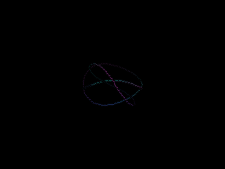
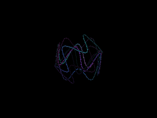
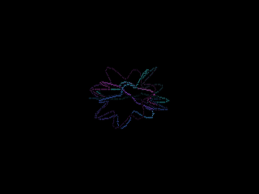
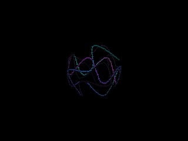
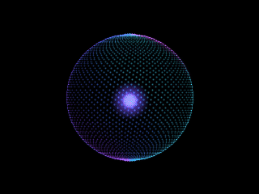

# assist-avatar

An animated, **child-safe** cyan "synthetic mind" for the **ESP32-S3-Box-3** voice
assistant (ESPHome + Home Assistant). A faceless, neon-glow avatar in the spirit of the
*Cyberpunk 2077* AIs — sub-pixel-smooth, **wall-clock-timed** motion that reacts to
every assistant state. No face, no harsh red, slow organic motion — it looks good on a
shelf at night and is safe in a child's room.

<p align="center">
  
</p>

It ships as an **ESPHome `external_components` overlay**: you keep the official Nabu
Casa voice-assistant firmware exactly as-is (wake word, the voice pipeline, timers and
the built-in connection screens all keep working and stay upgradable), and this package
overrides **only** the display rendering. Upstream still decides *which* state to show;
the avatar decides *how it looks* — and you pick (and persist) the look of every state
from Home Assistant with no reflash.

> **New in v0.5.0:** changing any per-state control from Home Assistant pops a
> **2-second full-screen preview** of that state, with a banner telling you exactly what
> you picked — so you can dial in animations, speeds and accent colours without guessing
> or rebooting.

---

## Table of contents

- [Install](#install) — [remote one-line](#option-a--remote-one-line-recommended) · [local files](#option-b--local-files)
- [The `avatar:` block](#the-avatar-block)
- [Controls you get in Home Assistant](#controls-you-get-in-home-assistant)
- [Live preview + banner](#live-preview--banner)
- [Typed-out dialog](#typed-out-dialog)
- [Gallery](#gallery)
- [Orb variations](#orb-variations)
- [How the engine works (contributors)](#how-the-engine-works-contributors)
- [Develop · Tests · GIFs](#develop-desktop-emulator)
- [Credits](#credits)

---

## Install

You need an ESP32-S3-Box-3 already flashed with the official ESPHome voice-assistant
firmware. The avatar is an overlay added **after** the voice-assistant package.

### Option A — remote, one line (recommended)

Works straight from the Home Assistant ESPHome dashboard — nothing to copy. Add the
avatar overlay package **after** the voice-assistant one, then add an **empty**
`avatar:` block. Keep your existing `esphome:` / `api:` / `wifi:` exactly as they are —
only add the lines shown here:

```yaml
packages:
  # the line your device already has (keep it):
  esphome.voice-assistant: github://esphome/wake-word-voice-assistants/esp32-s3-box-3/esp32-s3-box-3.factory.yaml@main
  # add the avatar overlay — must come AFTER the line above:
  assist-avatar: github://thekoma/assist-avatar/avatar-remote.yaml@v0.5.0

# An empty avatar: block mints all 9 states with their default animation + the
# full set of Home-Assistant controls. That is all a single device needs.
avatar:
```

Then **Install → Wirelessly**. Pin a release tag (e.g. `@v0.5.0`) so the YAML, the page
overlay and the C++ engine are all fetched from one commit.

### Option B — local files

Prerequisites: ESPHome (e.g. `uv venv && uv pip install esphome`).

1. Copy `components/` and `avatar-pages.yaml` next to your device YAML (e.g. into HA's
   `/config/esphome/`), or clone this repo.
2. Provide your secrets via `!secret` — a `secrets.yaml` with `wifi_ssid`,
   `wifi_password` and an `api_key` (generate one with `openssl rand -base64 32`).
3. Point `external_components` at the local component and include the page overlay
   **after** the voice-assistant package:

   ```yaml
   external_components:
     - source: { type: local, path: components }
       components: [avatar]

   packages:
     esphome.voice-assistant: github://esphome/wake-word-voice-assistants/esp32-s3-box-3/esp32-s3-box-3.factory.yaml@main
     # page overlay AFTER the VA factory package so its !extend targets exist:
     avatar_pages: !include avatar-pages.yaml

   # Empty = all 9 states defaulted + the full control set. Add per-state
   # overrides only if you want different first-boot defaults (see below).
   avatar:
   ```

4. Flash over USB the first time, then over the air: `esphome run esp32-s3-box-3.example.yaml`.

A complete, working device file is [`esp32-s3-box-3.example.yaml`](esp32-s3-box-3.example.yaml).

Then in Home Assistant: adopt the auto-discovered **ESPHome** device, assign it a
**Voice assistant pipeline**, keep **Wake word engine location = On device**, and say
**"Okay Nabu"** — the screen switches to the listening animation. The per-state
controls (below) appear under the device; change them live and they persist.

---

## The `avatar:` block

**The whole block is optional.** A bare `avatar:` (nothing under it) mints **all nine**
assistant states with their **manifest-default animation** plus the full set of
Home-Assistant controls — so a single-device install needs nothing more:

```yaml
avatar:
```

Any state you **omit** is treated exactly like that empty default. The block exists only
for **overrides** — to set different first-boot defaults, or to copy a known-good set of
defaults across multiple devices. The values you write are **first-boot defaults only**;
your Home Assistant changes survive reboots.

```yaml
avatar:
  thinking:
    animation: orb        # optional: an animation id (default: this state's manifest default)
    variation: calm       # optional: seed a non-default orb look (default: siri)
    speed: 1.2            # optional: first-boot speed value (default: manifest 1.0)
  idle:
    speed: 0.8            # everything else for `idle` stays at its defaults
    accent: "#00FFD9"    # optional: first-boot accent colour (colour-driven anims only)
  # every state is optional; omitted states get the manifest default + controls
```

Fields per state (**all optional**):

| Field | Meaning |
|---|---|
| `animation` | One of the catalogue ids (see below). Omitted → this state's manifest default (e.g. `idle` → `breathing_ring`, table below). |
| `variation` | First-boot variation, **only for animations that have variations** (today only `orb`: `siri / calm / sleeping / agitated / spike / happy / wireframe`). Omitted → `siri`. Setting it on an animation with no variations is a config error. |
| `speed` | First-boot speed **value** (a float like `1.5`), validated against the resolved animation's range (`0.3`–`10`). Omitted → manifest default (**1.0**). The live speed is still tuned from Home Assistant. |
| `accent` | First-boot accent **colour** as a hex string like `"#FF00AA"`. **Valid only for colour-driven animations** — setting it on a palette-driven animation (`orb`, `amber_pulse`) is a config error. Omitted → the manifest role default (cyan). |
| `id:` / `name:` | Override the auto-generated entity id / display name on any minted control if you ever need to. |

> `speed` and `accent` are **first-boot defaults**; the live values are tuned from Home
> Assistant (see [Controls](#controls-you-get-in-home-assistant)). The speed **number**
> and (for colour-driven animations) the accent **light** are always minted regardless.

**Animation catalogue — 10 modules (9 single-look + `orb`) → 16 selectable looks:**
`amber_pulse`, `breathing_ring`, `converging`, `dim_ring`, `loading_arc`, `orbits`,
`scan_arc`, `sonar`, `waveform` (one look each) **+ `orb`** (seven variations). Any
animation can be assigned to any state.

**Defaults per state:**

| State | Default animation |
|---|---|
| `idle` | `breathing_ring` |
| `listening` | `converging` |
| `thinking` | `orb` (siri) |
| `replying` | `waveform` |
| `error` | `amber_pulse` |
| `muted` | `dim_ring` |
| `booting` | `loading_arc` |
| `no_wifi` | `sonar` |
| `no_ha` | `scan_arc` |

---

## Controls you get in Home Assistant

For **every** one of the nine states the component auto-creates Home-Assistant entities,
named after the state's display name (`Idle`, `Listening`, …, `No Wi-Fi`, `No HA`) —
whether or not the state appears in the `avatar:` block. All picks **persist across
reboots**.

- **`<State> animation`** — a `select` listing **all 16 animation×variation permutations**
  as flat options. Single-look modules appear once by their manifest name (e.g.
  *Breathing ring*, *Converging particles*, *Waveform*, *Orbits*); the orb appears as seven
  options: **Orb — Siri**, **Orb — Calm**, **Orb — Sleeping**, **Orb — Agitated**,
  **Orb — Spike**, **Orb — Happy**, **Orb — Wireframe**. There is no separate "variation"
  picker — variation is baked into this one list.

- **`<State> animation speed`** — a `number` from **0.3× to 10×** (default **1×**, step
  0.1). Present for every state. Speed up the chatter or slow everything to a meditative
  crawl.

- **`<State> accent`** (RGB light) — recolours that state's animation in real time, but
  **only for states whose chosen animation declares a colour role.** The `orb` and
  `amber_pulse` are palette-driven (`colors: []`), so the **thinking** (orb) and **error**
  (amber_pulse) states expose **no accent light**. If you assign a palette animation to a
  state it renders in a default cyan; assign a colour-driven animation and the accent
  light appears.

> The accent recolours the **animation**, not the dialog text — the typed STT/TTS text
> is always a fixed phosphor green.

---

## Live preview + banner

**New in v0.5.0.** Changing **any** per-state control from Home Assistant — animation,
speed, **or** accent — shows **that** state's animation **full-screen for 2 seconds**,
overriding whatever page is currently displayed, with a top banner like:

```
Waveform selected for Replying, accent #00FFD9 at speed 1.5x
```

For palette-only states (thinking / error) the `accent #RRGGBB` clause is omitted:

```
Orb — Siri selected for Thinking at speed 1.0x
```

After 2 seconds it reverts to the live state on its own. Boot and the restore-from-flash
writes do **not** trigger a preview — a 3-second boot-settle gate swallows them, so you
only ever see a banner when *you* turn a knob.

## Typed-out dialog

While **thinking** and **replying**, your spoken request and the assistant's answer are
**typed out** over the avatar in a phosphor-CRT style (the VT323 font), revealed one
character at a time from the upstream STT/TTS text sensors. The dialog text is a fixed
phosphor green; the `<State> accent` controls recolour the animation, not the text.

---

## Gallery

Per-state default animations (320×240).

| Idle — `breathing_ring` | Listening — `converging` | Thinking — `orb` |
|:---:|:---:|:---:|
|  |  |  |
| connected, slow "breathing" ring | particles stream into a hot core | a Siri-style luminous orb |

| Replying — `waveform` | Error — `amber_pulse` | Muted — `dim_ring` |
|:---:|:---:|:---:|
|  |  |  |
| horizontal energy waveform | soft amber pulse — calm alert, never red | dim ring with a slash |

| Booting — `loading_arc` | No Wi-Fi — `sonar` | No HA — `scan_arc` |
|:---:|:---:|:---:|
|  |  |  |
| a loading arc filling up | searching the network (sonar waves) | linking to Home Assistant |

> Not shown above: **`orbits`** — orbiting particles, an alternate thinking look you can
> assign from any `<State> animation` select.

## Orb variations

The `orb` animation ships seven looks, surfaced as the seven **Orb — …** options in the
`<State> animation` select. Seed the first-boot default with `variation:` (e.g.
`variation: calm`).

| Siri | Calm | Sleeping |
|:---:|:---:|:---:|
|  |  |  |

| Agitated | Spike | Happy |
|:---:|:---:|:---:|
|  |  |  |

| Wireframe |  |  |
|:---:|:---:|:---:|
|  |  |  |

---

## How the engine works (contributors)

The official S3-Box-3 firmware renders its UI with a `display:` that has one **page per
state** (`idle_page`, `listening_page`, …, `no_wifi_page`, `no_ha_page`,
`initializing_page`, `timer_finished_page`) and switches between them. This overlay uses
ESPHome's `!extend` (in [`avatar-pages.yaml`](avatar-pages.yaml)) to replace each page's
draw lambda with a call into the avatar's runtime state table, and bumps the refresh
rate to **66 ms (~15 fps)** so the avatar animates (upstream leaves it at "never"):

```yaml
display:
  - id: !extend s3_box_lcd
    update_interval: 66ms
    pages:
      - id: !extend idle_page
        lambda: |-
          avatar::render_state(it, avatar::IDLE, millis());
          avatar::draw_preview_banner(it, id(ui_font), millis());
      # … one block per page (thinking/replying also overlay avatar::draw_dialog)
```

`render_state` reads the minted anim-select, speed-number and accent-light for that
phase and dispatches to the configured animation module. Because upstream already
decides *which* page is shown (Wi-Fi / HA / voice state), the avatar gets every state —
including the connection screens — for free. `timer_finished_page` reuses the
**REPLYING** animation.

Animation is driven by **wall-clock time** (`millis()`), not a frame counter, so motion
looks identical on the desktop emulator and on the device regardless of frame rate.

### The component

A self-contained ESPHome component lives at [`components/avatar/`](components/avatar/):

- **`base/`** — the source-of-truth headers: `avatar_math.h`, `avatar_draw.h`,
  `avatar_module.h` (the `ColorSet` / module contract), plus the host audition catalogue
  `avatar.h`.
- **`animations/<id>/`** — one drop-in folder per animation: a `<id>.h` render function
  and a `manifest.yaml`.
- **`__init__.py`** — the codegen. It **discovers** the manifests at build time and
  generates the C++ dispatch plus the Home-Assistant controls.
- **`avatar_render_state.{h,cpp}`** — the runtime state table (`register_state` /
  `render_state` / `draw_preview_banner`) read by the page lambdas.
- **`avatar_preview.h`** — the 2-second preview subsystem (boot-settle gate + arm/expire).

A manifest declares everything the codegen needs:

```yaml
# components/avatar/animations/breathing_ring/manifest.yaml
manifest_version: 1
id: breathing_ring
name: "Breathing ring"
entry:
  header: animations/breathing_ring/breathing_ring.h
  function: avatar::mod::breathing_ring::render
colors:                                  # [] = palette-driven (no accent light minted)
  - { role: ring, name: "Ring", default: "#00FFD9" }
speed: { min: 0.3, max: 10.0, default: 1.0 }
variations: []                           # e.g. orb has [siri, calm, sleeping, agitated, spike, happy]
phases: [idle]                           # documentary: the state this is the default for
```

### Build-time flow (`__init__.py`)

1. **Discover** every `animations/*/manifest.yaml` (sorted by folder/id) and **flatten**
   the catalogue into the 16 animation×variation permutations. A module with no
   variations yields one entry (label = manifest name); `orb` yields seven
   (`Orb — Siri` … `Orb — Wireframe`, via `"<name> — <Variation>"`). The list index is the
   shared dispatch-case index **and** the `select` option index.
2. **Generate `avatar_dispatch.h`** — a `switch (idx)` whose cases call each module's
   `render(it, now_ms, cs, speed, variation_idx)`.
3. **Mint controls** per configured state: the flattened `animation` select (seeded to
   the chosen default's flat index), a `speed` number (`min/max` from the manifest, step
   0.1, initial value from the manifest default), and one RGB accent light per manifest
   colour role (none for palette modules). Ids are auto-derived (`<state>_anim`,
   `<state>_speed`, `<state>_<role>`) and persist via `RESTORE_AND_ON`, so the YAML value
   is a first-boot default only.
4. **Register** each phase into the runtime table; each control learns its phase id so a
   genuine HA change can arm the 2-second preview.
5. **Final-validate** that the voice-assistant pages exist and that a page calls
   `avatar::render_state` — failing with a clear message ("include the avatar-pages.yaml
   package after the voice-assistant package") if the VA package or the page overlay is
   missing or ordered wrong.

A module's `render(it, now_ms, cs, speed, variation_idx)` reads its accent colours from
`cs` (`ColorSet`, up to 4 slots, in manifest `colors[]` order). For a palette state with
no accent light, the runtime seeds a default cyan so any animation assigned there stays
visible.

### Adding an animation

1. Create `components/avatar/animations/<id>/<id>.h` with an
   `avatar::mod::<id>::render(...)` function.
2. Add a `manifest.yaml` (copy the shape above), declaring `colors`, `speed`, and any
   `variations`.
3. Rebuild — it auto-appears in every `<State> animation` select and the audition loop.
   No edits to the codegen.

---

## Develop (desktop emulator)

ESPHome's SDL backend runs the display on your computer, so you can iterate on graphics
in seconds — no flashing. Requires SDL2 (`brew install sdl2 libsodium` on macOS) and
ESPHome.

```bash
./dev.sh          # = esphome clean + run dev-host.yaml  (a window opens, ~60fps)
```

It opens in **audition mode**: click the window to cycle through the whole animation
catalogue, each shown full-screen with its name at the top. (The audition loop uses the
host catalogue in `base/avatar.h`, whose orb labels read "Siri orb", "Calm orb", … —
slightly different wording from the Home Assistant "Orb — …" select labels.) Edit any
module header under `components/avatar/animations/` and re-run `./dev.sh`.

> **Why `./dev.sh` and not a bare `esphome run`?** ESPHome only re-runs code generation
> (and re-copies headers) when the YAML changes. Editing only the `.h` files leaves the
> config hash unchanged, so a plain run launches the **old** binary. `dev.sh` does an
> `esphome clean` first to force a fresh build.

## Tests

Pure math and render bounds are tested on the host (no hardware). The engine source
lives under the component, so add both include roots:

```bash
# math + render-bounds (header-only)
c++ -std=c++17 -Itest/shim -Icomponents/avatar/base -Icomponents/avatar \
    test/test_render.cpp -o /tmp/t && /tmp/t

# runtime state table / preview (links the .cpp)
c++ -std=c++17 -Itest/shim -Icomponents/avatar/base -Icomponents/avatar \
    test/test_render_state.cpp components/avatar/avatar_render_state.cpp -o /tmp/t && /tmp/t
```

`test_render.cpp` sweeps every state across time against a mock display that fails on any
out-of-bounds draw — it catches off-screen writes (the kind that can bootloop the device)
on the host, before flashing.

## Regenerate the GIFs

```bash
./tools/make_gifs.sh    # renders the gallery + orb variations to assets/*.gif (needs ffmpeg)
```

This drives the same per-module render functions used on the device (via the host render
harness in `tools/`) to produce the nine per-state defaults and the seven orb variations
shown above.

---

## Credits

Built on the official
[ESPHome wake-word voice assistants](https://github.com/esphome/wake-word-voice-assistants).
Avatar engine and packaging by [@thekoma](https://github.com/thekoma). MIT licensed.